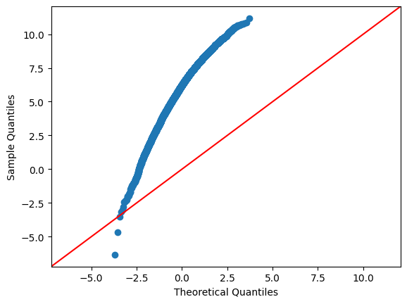
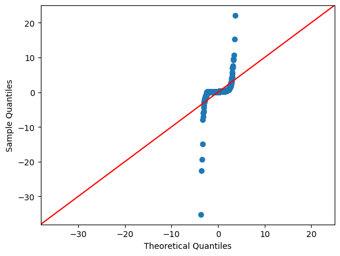
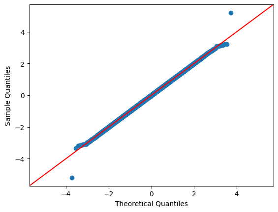

## EXNO-3-DS

# AIM:
To read the given data and perform Feature Encoding and Transformation process and save the data to a file.

# ALGORITHM:
STEP 1:Read the given Data.
STEP 2:Clean the Data Set using Data Cleaning Process.
STEP 3:Apply Feature Encoding for the feature in the data set.
STEP 4:Apply Feature Transformation for the feature in the data set.
STEP 5:Save the data to the file.

# FEATURE ENCODING:
1. Ordinal Encoding
An ordinal encoding involves mapping each unique label to an integer value. This type of encoding is really only appropriate if there is a known relationship between the categories. This relationship does exist for some of the variables in our dataset, and ideally, this should be harnessed when preparing the data.
2. Label Encoding
Label encoding is a simple and straight forward approach. This converts each value in a categorical column into a numerical value. Each value in a categorical column is called Label.
3. Binary Encoding
Binary encoding converts a category into binary digits. Each binary digit creates one feature column. If there are n unique categories, then binary encoding results in the only log(base 2)ⁿ features.
4. One Hot Encoding
We use this categorical data encoding technique when the features are nominal(do not have any order). In one hot encoding, for each level of a categorical feature, we create a new variable. Each category is mapped with a binary variable containing either 0 or 1. Here, 0 represents the absence, and 1 represents the presence of that category.

# Methods Used for Data Transformation:
  # 1. FUNCTION TRANSFORMATION
• Log Transformation
• Reciprocal Transformation
• Square Root Transformation
• Square Transformation
  # 2. POWER TRANSFORMATION
• Boxcox method
• Yeojohnson method

# CODING AND OUTPUT:
```python
import pandas as pd
df = pd.read_csv("Encoding Data.csv")
df
```


<div id="df-45f0d0a6-8741-4668-a1e2-f14ca799d9ca" class="colab-df-container">
<div>
<table border="1" class="dataframe">
<thead>
<tr style="text-align: right;">
<th></th>
<th>id</th>
<th>bin_1</th>
<th>bin_2</th>
<th>nom_0</th>
<th>ord_2</th>
</tr>
</thead>
<tbody>
<tr>
<th>0</th>
<td>0</td>
<td>F</td>
<td>N</td>
<td>Red</td>
<td>Hot</td>
</tr>
<tr>
<th>1</th>
<td>1</td>
<td>F</td>
<td>Y</td>
<td>Blue</td>
<td>Warm</td>
</tr>
<tr>
<th>2</th>
<td>2</td>
<td>F</td>
<td>N</td>
<td>Blue</td>
<td>Cold</td>
</tr>
<tr>
<th>3</th>
<td>3</td>
<td>F</td>
<td>N</td>
<td>Green</td>
<td>Warm</td>
</tr>
<tr>
<th>4</th>
<td>4</td>
<td>T</td>
<td>N</td>
<td>Red</td>
<td>Cold</td>
</tr>
<tr>
<th>5</th>
<td>5</td>
<td>T</td>
<td>N</td>
<td>Green</td>
<td>Hot</td>
</tr>
<tr>
<th>6</th>
<td>6</td>
<td>F</td>
<td>N</td>
<td>Red</td>
<td>Cold</td>
</tr>
<tr>
<th>7</th>
<td>7</td>
<td>T</td>
<td>N</td>
<td>Red</td>
<td>Cold</td>
</tr>
<tr>
<th>8</th>
<td>8</td>
<td>F</td>
<td>N</td>
<td>Blue</td>
<td>Warm</td>
</tr>
<tr>
<th>9</th>
<td>9</td>
<td>F</td>
<td>Y</td>
<td>Red</td>
<td>Hot</td>
</tr>
</tbody>
</table>
</div>
<div class="colab-df-buttons">

<div class="colab-df-container">


</div>


<div id="id_493fa257-30c9-485e-8272-89f25746da71">
</div>

</div>
</div>


```python
from sklearn.preprocessing import LabelEncoder,OrdinalEncoder
pm=["Hot","Warm","Cold"]
e1 = OrdinalEncoder(categories=[pm])
e1.fit_transform(df[["ord_2"]])
```


array([[0.],
[1.],
[2.],
[1.],
[2.],
[0.],
[2.],
[2.],
[1.],
[0.]])


```python
df["bo_1"]=e1.fit_transform(df[["ord_2"]])
df
```


<div id="df-ec0ff635-3b30-4007-b0d5-04402c18c9fb" class="colab-df-container">
<div>
<table border="1" class="dataframe">
<thead>
<tr style="text-align: right;">
<th></th>
<th>id</th>
<th>bin_1</th>
<th>bin_2</th>
<th>nom_0</th>
<th>ord_2</th>
<th>bo_1</th>
</tr>
</thead>
<tbody>
<tr>
<th>0</th>
<td>0</td>
<td>F</td>
<td>N</td>
<td>Red</td>
<td>Hot</td>
<td>0.0</td>
</tr>
<tr>
<th>1</th>
<td>1</td>
<td>F</td>
<td>Y</td>
<td>Blue</td>
<td>Warm</td>
<td>1.0</td>
</tr>
<tr>
<th>2</th>
<td>2</td>
<td>F</td>
<td>N</td>
<td>Blue</td>
<td>Cold</td>
<td>2.0</td>
</tr>
<tr>
<th>3</th>
<td>3</td>
<td>F</td>
<td>N</td>
<td>Green</td>
<td>Warm</td>
<td>1.0</td>
</tr>
<tr>
<th>4</th>
<td>4</td>
<td>T</td>
<td>N</td>
<td>Red</td>
<td>Cold</td>
<td>2.0</td>
</tr>
<tr>
<th>5</th>
<td>5</td>
<td>T</td>
<td>N</td>
<td>Green</td>
<td>Hot</td>
<td>0.0</td>
</tr>
<tr>
<th>6</th>
<td>6</td>
<td>F</td>
<td>N</td>
<td>Red</td>
<td>Cold</td>
<td>2.0</td>
</tr>
<tr>
<th>7</th>
<td>7</td>
<td>T</td>
<td>N</td>
<td>Red</td>
<td>Cold</td>
<td>2.0</td>
</tr>
<tr>
<th>8</th>
<td>8</td>
<td>F</td>
<td>N</td>
<td>Blue</td>
<td>Warm</td>
<td>1.0</td>
</tr>
<tr>
<th>9</th>
<td>9</td>
<td>F</td>
<td>Y</td>
<td>Red</td>
<td>Hot</td>
<td>0.0</td>
</tr>
</tbody>
</table>
</div>
<div class="colab-df-buttons">

<div class="colab-df-container">


</div>


<div id="id_41228514-9eeb-4bc6-a7c1-b77e9f954296">
</div>

</div>
</div>


```python
dfc=df.copy()
le = LabelEncoder()
le.fit_transform(dfc[["ord_2"]])
```

/usr/local/lib/python3.12/dist-packages/sklearn/preprocessing/_label.py:110: DataConversionWarning: A column-vector y was passed when a 1d array was expected. Please change the shape of y to (n_samples, ), for example using ravel().
y = column_or_1d(y, warn=True)


array([1, 2, 0, 2, 0, 1, 0, 0, 2, 1])


```python
dfc["bo_1"]=le.fit_transform(df[["ord_2"]])
dfc
```

/usr/local/lib/python3.12/dist-packages/sklearn/preprocessing/_label.py:110: DataConversionWarning: A column-vector y was passed when a 1d array was expected. Please change the shape of y to (n_samples, ), for example using ravel().
y = column_or_1d(y, warn=True)


<div id="df-5a35ba41-224c-4b7e-9410-ab983bf07c03" class="colab-df-container">
<div>
<table border="1" class="dataframe">
<thead>
<tr style="text-align: right;">
<th></th>
<th>id</th>
<th>bin_1</th>
<th>bin_2</th>
<th>nom_0</th>
<th>ord_2</th>
<th>bo_1</th>
</tr>
</thead>
<tbody>
<tr>
<th>0</th>
<td>0</td>
<td>F</td>
<td>N</td>
<td>Red</td>
<td>Hot</td>
<td>1</td>
</tr>
<tr>
<th>1</th>
<td>1</td>
<td>F</td>
<td>Y</td>
<td>Blue</td>
<td>Warm</td>
<td>2</td>
</tr>
<tr>
<th>2</th>
<td>2</td>
<td>F</td>
<td>N</td>
<td>Blue</td>
<td>Cold</td>
<td>0</td>
</tr>
<tr>
<th>3</th>
<td>3</td>
<td>F</td>
<td>N</td>
<td>Green</td>
<td>Warm</td>
<td>2</td>
</tr>
<tr>
<th>4</th>
<td>4</td>
<td>T</td>
<td>N</td>
<td>Red</td>
<td>Cold</td>
<td>0</td>
</tr>
<tr>
<th>5</th>
<td>5</td>
<td>T</td>
<td>N</td>
<td>Green</td>
<td>Hot</td>
<td>1</td>
</tr>
<tr>
<th>6</th>
<td>6</td>
<td>F</td>
<td>N</td>
<td>Red</td>
<td>Cold</td>
<td>0</td>
</tr>
<tr>
<th>7</th>
<td>7</td>
<td>T</td>
<td>N</td>
<td>Red</td>
<td>Cold</td>
<td>0</td>
</tr>
<tr>
<th>8</th>
<td>8</td>
<td>F</td>
<td>N</td>
<td>Blue</td>
<td>Warm</td>
<td>2</td>
</tr>
<tr>
<th>9</th>
<td>9</td>
<td>F</td>
<td>Y</td>
<td>Red</td>
<td>Hot</td>
<td>1</td>
</tr>
</tbody>
</table>
</div>
<div class="colab-df-buttons">

<div class="colab-df-container">


</div>


<div id="id_a96497a8-742a-43bc-ab41-3b79efb21c80">
</div>

</div>
</div>


```python
from sklearn.preprocessing import OneHotEncoder
ohe = OneHotEncoder(sparse_output=False)
df1 = df.copy()
enc = pd.DataFrame(ohe.fit_transform(df1[["nom_0"]]))
enc

```


<div id="df-9e5c6ced-5a04-40cd-84ec-f1cf66c7a788" class="colab-df-container">
<div>
<table border="1" class="dataframe">
<thead>
<tr style="text-align: right;">
<th></th>
<th>0</th>
<th>1</th>
<th>2</th>
</tr>
</thead>
<tbody>
<tr>
<th>0</th>
<td>0.0</td>
<td>0.0</td>
<td>1.0</td>
</tr>
<tr>
<th>1</th>
<td>1.0</td>
<td>0.0</td>
<td>0.0</td>
</tr>
<tr>
<th>2</th>
<td>1.0</td>
<td>0.0</td>
<td>0.0</td>
</tr>
<tr>
<th>3</th>
<td>0.0</td>
<td>1.0</td>
<td>0.0</td>
</tr>
<tr>
<th>4</th>
<td>0.0</td>
<td>0.0</td>
<td>1.0</td>
</tr>
<tr>
<th>5</th>
<td>0.0</td>
<td>1.0</td>
<td>0.0</td>
</tr>
<tr>
<th>6</th>
<td>0.0</td>
<td>0.0</td>
<td>1.0</td>
</tr>
<tr>
<th>7</th>
<td>0.0</td>
<td>0.0</td>
<td>1.0</td>
</tr>
<tr>
<th>8</th>
<td>1.0</td>
<td>0.0</td>
<td>0.0</td>
</tr>
<tr>
<th>9</th>
<td>0.0</td>
<td>0.0</td>
<td>1.0</td>
</tr>
</tbody>
</table>
</div>
<div class="colab-df-buttons">

<div class="colab-df-container">


</div>


<div id="id_599dc4a5-4f63-420a-a8b8-d999d5842023">
</div>

</div>
</div>


```python
df1=pd.concat((df1,enc),axis=1)
df1
```


<div id="df-e938a203-2583-4765-a5f1-ce062004565e" class="colab-df-container">
<div>
<table border="1" class="dataframe">
<thead>
<tr style="text-align: right;">
<th></th>
<th>id</th>
<th>bin_1</th>
<th>bin_2</th>
<th>nom_0</th>
<th>ord_2</th>
<th>bo_1</th>
<th>0</th>
<th>1</th>
<th>2</th>
</tr>
</thead>
<tbody>
<tr>
<th>0</th>
<td>0</td>
<td>F</td>
<td>N</td>
<td>Red</td>
<td>Hot</td>
<td>0.0</td>
<td>0.0</td>
<td>0.0</td>
<td>1.0</td>
</tr>
<tr>
<th>1</th>
<td>1</td>
<td>F</td>
<td>Y</td>
<td>Blue</td>
<td>Warm</td>
<td>1.0</td>
<td>1.0</td>
<td>0.0</td>
<td>0.0</td>
</tr>
<tr>
<th>2</th>
<td>2</td>
<td>F</td>
<td>N</td>
<td>Blue</td>
<td>Cold</td>
<td>2.0</td>
<td>1.0</td>
<td>0.0</td>
<td>0.0</td>
</tr>
<tr>
<th>3</th>
<td>3</td>
<td>F</td>
<td>N</td>
<td>Green</td>
<td>Warm</td>
<td>1.0</td>
<td>0.0</td>
<td>1.0</td>
<td>0.0</td>
</tr>
<tr>
<th>4</th>
<td>4</td>
<td>T</td>
<td>N</td>
<td>Red</td>
<td>Cold</td>
<td>2.0</td>
<td>0.0</td>
<td>0.0</td>
<td>1.0</td>
</tr>
<tr>
<th>5</th>
<td>5</td>
<td>T</td>
<td>N</td>
<td>Green</td>
<td>Hot</td>
<td>0.0</td>
<td>0.0</td>
<td>1.0</td>
<td>0.0</td>
</tr>
<tr>
<th>6</th>
<td>6</td>
<td>F</td>
<td>N</td>
<td>Red</td>
<td>Cold</td>
<td>2.0</td>
<td>0.0</td>
<td>0.0</td>
<td>1.0</td>
</tr>
<tr>
<th>7</th>
<td>7</td>
<td>T</td>
<td>N</td>
<td>Red</td>
<td>Cold</td>
<td>2.0</td>
<td>0.0</td>
<td>0.0</td>
<td>1.0</td>
</tr>
<tr>
<th>8</th>
<td>8</td>
<td>F</td>
<td>N</td>
<td>Blue</td>
<td>Warm</td>
<td>1.0</td>
<td>1.0</td>
<td>0.0</td>
<td>0.0</td>
</tr>
<tr>
<th>9</th>
<td>9</td>
<td>F</td>
<td>Y</td>
<td>Red</td>
<td>Hot</td>
<td>0.0</td>
<td>0.0</td>
<td>0.0</td>
<td>1.0</td>
</tr>
</tbody>
</table>
</div>
<div class="colab-df-buttons">

<div class="colab-df-container">


</div>


<div id="id_130d1ab3-126f-4a91-9c64-98a258aba1e0">
</div>

</div>
</div>


```python
pip install --upgrade category_encoders

```

Collecting category_encoders
Downloading category_encoders-2.9.0-py3-none-any.whl.metadata (7.9 kB)
Requirement already satisfied: numpy>=1.14.0 in /usr/local/lib/python3.12/dist-packages (from category_encoders) (2.0.2)
Requirement already satisfied: pandas>=1.0.5 in /usr/local/lib/python3.12/dist-packages (from category_encoders) (2.2.2)
Requirement already satisfied: patsy>=0.5.1 in /usr/local/lib/python3.12/dist-packages (from category_encoders) (1.0.2)
Requirement already satisfied: scikit-learn>=1.6.0 in /usr/local/lib/python3.12/dist-packages (from category_encoders) (1.6.1)
Requirement already satisfied: scipy>=1.0.0 in /usr/local/lib/python3.12/dist-packages (from category_encoders) (1.16.3)
Requirement already satisfied: statsmodels>=0.9.0 in /usr/local/lib/python3.12/dist-packages (from category_encoders) (0.14.6)
Requirement already satisfied: python-dateutil>=2.8.2 in /usr/local/lib/python3.12/dist-packages (from pandas>=1.0.5->category_encoders) (2.9.0.post0)
Requirement already satisfied: pytz>=2020.1 in /usr/local/lib/python3.12/dist-packages (from pandas>=1.0.5->category_encoders) (2025.2)
Requirement already satisfied: tzdata>=2022.7 in /usr/local/lib/python3.12/dist-packages (from pandas>=1.0.5->category_encoders) (2025.3)
Requirement already satisfied: joblib>=1.2.0 in /usr/local/lib/python3.12/dist-packages (from scikit-learn>=1.6.0->category_encoders) (1.5.3)
Requirement already satisfied: threadpoolctl>=3.1.0 in /usr/local/lib/python3.12/dist-packages (from scikit-learn>=1.6.0->category_encoders) (3.6.0)
Requirement already satisfied: packaging>=21.3 in /usr/local/lib/python3.12/dist-packages (from statsmodels>=0.9.0->category_encoders) (26.0)
Requirement already satisfied: six>=1.5 in /usr/local/lib/python3.12/dist-packages (from python-dateutil>=2.8.2->pandas>=1.0.5->category_encoders) (1.17.0)
Downloading category_encoders-2.9.0-py3-none-any.whl (85 kB)
   ━━━━━━━━━━━━━━━━━━━━━━━━━━━━━━━━━━━━━━━━ 85.9/85.9 kB 4.3 MB/s eta 0:00:00
[?25hInstalling collected packages: category_encoders
Successfully installed category_encoders-2.9.0


```python
pd.get_dummies(df,columns=["nom_0"])
```


<div id="df-5e88adb8-409f-4204-8949-07b6816d1cb6" class="colab-df-container">
<div>
<table border="1" class="dataframe">
<thead>
<tr style="text-align: right;">
<th></th>
<th>id</th>
<th>bin_1</th>
<th>bin_2</th>
<th>ord_2</th>
<th>bo_1</th>
<th>nom_0_Blue</th>
<th>nom_0_Green</th>
<th>nom_0_Red</th>
</tr>
</thead>
<tbody>
<tr>
<th>0</th>
<td>0</td>
<td>F</td>
<td>N</td>
<td>Hot</td>
<td>0.0</td>
<td>False</td>
<td>False</td>
<td>True</td>
</tr>
<tr>
<th>1</th>
<td>1</td>
<td>F</td>
<td>Y</td>
<td>Warm</td>
<td>1.0</td>
<td>True</td>
<td>False</td>
<td>False</td>
</tr>
<tr>
<th>2</th>
<td>2</td>
<td>F</td>
<td>N</td>
<td>Cold</td>
<td>2.0</td>
<td>True</td>
<td>False</td>
<td>False</td>
</tr>
<tr>
<th>3</th>
<td>3</td>
<td>F</td>
<td>N</td>
<td>Warm</td>
<td>1.0</td>
<td>False</td>
<td>True</td>
<td>False</td>
</tr>
<tr>
<th>4</th>
<td>4</td>
<td>T</td>
<td>N</td>
<td>Cold</td>
<td>2.0</td>
<td>False</td>
<td>False</td>
<td>True</td>
</tr>
<tr>
<th>5</th>
<td>5</td>
<td>T</td>
<td>N</td>
<td>Hot</td>
<td>0.0</td>
<td>False</td>
<td>True</td>
<td>False</td>
</tr>
<tr>
<th>6</th>
<td>6</td>
<td>F</td>
<td>N</td>
<td>Cold</td>
<td>2.0</td>
<td>False</td>
<td>False</td>
<td>True</td>
</tr>
<tr>
<th>7</th>
<td>7</td>
<td>T</td>
<td>N</td>
<td>Cold</td>
<td>2.0</td>
<td>False</td>
<td>False</td>
<td>True</td>
</tr>
<tr>
<th>8</th>
<td>8</td>
<td>F</td>
<td>N</td>
<td>Warm</td>
<td>1.0</td>
<td>True</td>
<td>False</td>
<td>False</td>
</tr>
<tr>
<th>9</th>
<td>9</td>
<td>F</td>
<td>Y</td>
<td>Hot</td>
<td>0.0</td>
<td>False</td>
<td>False</td>
<td>True</td>
</tr>
</tbody>
</table>
</div>
<div class="colab-df-buttons">

<div class="colab-df-container">


</div>


</div>
</div>


```python
from category_encoders import BinaryEncoder
da = pd.read_csv("data.csv")
da
```


<div id="df-c6b2e7c9-29d1-4d03-a289-8d26727fbbd0" class="colab-df-container">
<div>
<table border="1" class="dataframe">
<thead>
<tr style="text-align: right;">
<th></th>
<th>id</th>
<th>bin_1</th>
<th>bin_2</th>
<th>City</th>
<th>Ord_1</th>
<th>Ord_2</th>
<th>Target</th>
</tr>
</thead>
<tbody>
<tr>
<th>0</th>
<td>0</td>
<td>F</td>
<td>N</td>
<td>Delhi</td>
<td>Hot</td>
<td>High School</td>
<td>0</td>
</tr>
<tr>
<th>1</th>
<td>1</td>
<td>F</td>
<td>Y</td>
<td>Bangalore</td>
<td>Warm</td>
<td>Masters</td>
<td>1</td>
</tr>
<tr>
<th>2</th>
<td>2</td>
<td>M</td>
<td>N</td>
<td>Mumbai</td>
<td>Very Hot</td>
<td>Diploma</td>
<td>1</td>
</tr>
<tr>
<th>3</th>
<td>3</td>
<td>M</td>
<td>Y</td>
<td>Chennai</td>
<td>Cold</td>
<td>Bachelors</td>
<td>0</td>
</tr>
<tr>
<th>4</th>
<td>4</td>
<td>M</td>
<td>Y</td>
<td>Delhi</td>
<td>Cold</td>
<td>Bachelors</td>
<td>1</td>
</tr>
<tr>
<th>5</th>
<td>5</td>
<td>F</td>
<td>N</td>
<td>Delhi</td>
<td>Very Hot</td>
<td>Masters</td>
<td>0</td>
</tr>
<tr>
<th>6</th>
<td>6</td>
<td>M</td>
<td>N</td>
<td>Chennai</td>
<td>Warm</td>
<td>PhD</td>
<td>1</td>
</tr>
<tr>
<th>7</th>
<td>7</td>
<td>F</td>
<td>N</td>
<td>Chennai</td>
<td>Hot</td>
<td>High School</td>
<td>1</td>
</tr>
<tr>
<th>8</th>
<td>8</td>
<td>M</td>
<td>N</td>
<td>Delhi</td>
<td>Very Hot</td>
<td>High School</td>
<td>0</td>
</tr>
<tr>
<th>9</th>
<td>9</td>
<td>F</td>
<td>Y</td>
<td>Delhi</td>
<td>Warm</td>
<td>PhD</td>
<td>0</td>
</tr>
</tbody>
</table>
</div>
<div class="colab-df-buttons">

<div class="colab-df-container">


</div>


<div id="id_941aac91-7e98-43c8-88f4-237d7d896fd9">
</div>

</div>
</div>


```python
be = BinaryEncoder()
dac=da.copy()
benc=be.fit_transform(dac["City"])
benc
```


<div id="df-8c19f9c2-a503-4f79-8ef8-7ce9905fdd05" class="colab-df-container">
<div>
<table border="1" class="dataframe">
<thead>
<tr style="text-align: right;">
<th></th>
<th>City_0</th>
<th>City_1</th>
<th>City_2</th>
</tr>
</thead>
<tbody>
<tr>
<th>0</th>
<td>0</td>
<td>0</td>
<td>1</td>
</tr>
<tr>
<th>1</th>
<td>0</td>
<td>1</td>
<td>0</td>
</tr>
<tr>
<th>2</th>
<td>0</td>
<td>1</td>
<td>1</td>
</tr>
<tr>
<th>3</th>
<td>1</td>
<td>0</td>
<td>0</td>
</tr>
<tr>
<th>4</th>
<td>0</td>
<td>0</td>
<td>1</td>
</tr>
<tr>
<th>5</th>
<td>0</td>
<td>0</td>
<td>1</td>
</tr>
<tr>
<th>6</th>
<td>1</td>
<td>0</td>
<td>0</td>
</tr>
<tr>
<th>7</th>
<td>1</td>
<td>0</td>
<td>0</td>
</tr>
<tr>
<th>8</th>
<td>0</td>
<td>0</td>
<td>1</td>
</tr>
<tr>
<th>9</th>
<td>0</td>
<td>0</td>
<td>1</td>
</tr>
</tbody>
</table>
</div>
<div class="colab-df-buttons">

<div class="colab-df-container">


</div>


<div id="id_1c57a12d-5fbb-4a2d-8c49-028e32e66dec">
</div>

</div>
</div>


```python
dac=pd.concat((dac,benc),axis=1)
dac
```


<div id="df-792acdf9-44bc-4bae-a1de-f64d56a3da58" class="colab-df-container">
<div>
<table border="1" class="dataframe">
<thead>
<tr style="text-align: right;">
<th></th>
<th>id</th>
<th>bin_1</th>
<th>bin_2</th>
<th>City</th>
<th>Ord_1</th>
<th>Ord_2</th>
<th>Target</th>
<th>City_0</th>
<th>City_1</th>
<th>City_2</th>
</tr>
</thead>
<tbody>
<tr>
<th>0</th>
<td>0</td>
<td>F</td>
<td>N</td>
<td>Delhi</td>
<td>Hot</td>
<td>High School</td>
<td>0</td>
<td>0</td>
<td>0</td>
<td>1</td>
</tr>
<tr>
<th>1</th>
<td>1</td>
<td>F</td>
<td>Y</td>
<td>Bangalore</td>
<td>Warm</td>
<td>Masters</td>
<td>1</td>
<td>0</td>
<td>1</td>
<td>0</td>
</tr>
<tr>
<th>2</th>
<td>2</td>
<td>M</td>
<td>N</td>
<td>Mumbai</td>
<td>Very Hot</td>
<td>Diploma</td>
<td>1</td>
<td>0</td>
<td>1</td>
<td>1</td>
</tr>
<tr>
<th>3</th>
<td>3</td>
<td>M</td>
<td>Y</td>
<td>Chennai</td>
<td>Cold</td>
<td>Bachelors</td>
<td>0</td>
<td>1</td>
<td>0</td>
<td>0</td>
</tr>
<tr>
<th>4</th>
<td>4</td>
<td>M</td>
<td>Y</td>
<td>Delhi</td>
<td>Cold</td>
<td>Bachelors</td>
<td>1</td>
<td>0</td>
<td>0</td>
<td>1</td>
</tr>
<tr>
<th>5</th>
<td>5</td>
<td>F</td>
<td>N</td>
<td>Delhi</td>
<td>Very Hot</td>
<td>Masters</td>
<td>0</td>
<td>0</td>
<td>0</td>
<td>1</td>
</tr>
<tr>
<th>6</th>
<td>6</td>
<td>M</td>
<td>N</td>
<td>Chennai</td>
<td>Warm</td>
<td>PhD</td>
<td>1</td>
<td>1</td>
<td>0</td>
<td>0</td>
</tr>
<tr>
<th>7</th>
<td>7</td>
<td>F</td>
<td>N</td>
<td>Chennai</td>
<td>Hot</td>
<td>High School</td>
<td>1</td>
<td>1</td>
<td>0</td>
<td>0</td>
</tr>
<tr>
<th>8</th>
<td>8</td>
<td>M</td>
<td>N</td>
<td>Delhi</td>
<td>Very Hot</td>
<td>High School</td>
<td>0</td>
<td>0</td>
<td>0</td>
<td>1</td>
</tr>
<tr>
<th>9</th>
<td>9</td>
<td>F</td>
<td>Y</td>
<td>Delhi</td>
<td>Warm</td>
<td>PhD</td>
<td>0</td>
<td>0</td>
<td>0</td>
<td>1</td>
</tr>
</tbody>
</table>
</div>
<div class="colab-df-buttons">

<div class="colab-df-container">


</div>


<div id="id_6d74ba5b-d13a-494c-a51b-c7927c41b6d4">
</div>

</div>
</div>


```python
from category_encoders import TargetEncoder
te = TargetEncoder()
da1 = da.copy()
tenc=te.fit_transform(da1["City"],da1["Target"])
tenc
```


<div id="df-e6f03eed-25b8-4367-8ec5-983559b3fa08" class="colab-df-container">
<div>
<table border="1" class="dataframe">
<thead>
<tr style="text-align: right;">
<th></th>
<th>City</th>
</tr>
</thead>
<tbody>
<tr>
<th>0</th>
<td>0.445272</td>
</tr>
<tr>
<th>1</th>
<td>0.565054</td>
</tr>
<tr>
<th>2</th>
<td>0.565054</td>
</tr>
<tr>
<th>3</th>
<td>0.525744</td>
</tr>
<tr>
<th>4</th>
<td>0.445272</td>
</tr>
<tr>
<th>5</th>
<td>0.445272</td>
</tr>
<tr>
<th>6</th>
<td>0.525744</td>
</tr>
<tr>
<th>7</th>
<td>0.525744</td>
</tr>
<tr>
<th>8</th>
<td>0.445272</td>
</tr>
<tr>
<th>9</th>
<td>0.445272</td>
</tr>
</tbody>
</table>
</div>
<div class="colab-df-buttons">

<div class="colab-df-container">


</div>


<div id="id_9cd242be-6acd-44b9-b926-13ff8ba3cd99">
</div>

</div>
</div>


```python
da1=pd.concat((da1,tenc),axis=1)
da1
```


<div id="df-0f77ff21-ae02-4896-b23b-083d4bfbcd3c" class="colab-df-container">
<div>
<table border="1" class="dataframe">
<thead>
<tr style="text-align: right;">
<th></th>
<th>id</th>
<th>bin_1</th>
<th>bin_2</th>
<th>City</th>
<th>Ord_1</th>
<th>Ord_2</th>
<th>Target</th>
<th>City</th>
</tr>
</thead>
<tbody>
<tr>
<th>0</th>
<td>0</td>
<td>F</td>
<td>N</td>
<td>Delhi</td>
<td>Hot</td>
<td>High School</td>
<td>0</td>
<td>0.445272</td>
</tr>
<tr>
<th>1</th>
<td>1</td>
<td>F</td>
<td>Y</td>
<td>Bangalore</td>
<td>Warm</td>
<td>Masters</td>
<td>1</td>
<td>0.565054</td>
</tr>
<tr>
<th>2</th>
<td>2</td>
<td>M</td>
<td>N</td>
<td>Mumbai</td>
<td>Very Hot</td>
<td>Diploma</td>
<td>1</td>
<td>0.565054</td>
</tr>
<tr>
<th>3</th>
<td>3</td>
<td>M</td>
<td>Y</td>
<td>Chennai</td>
<td>Cold</td>
<td>Bachelors</td>
<td>0</td>
<td>0.525744</td>
</tr>
<tr>
<th>4</th>
<td>4</td>
<td>M</td>
<td>Y</td>
<td>Delhi</td>
<td>Cold</td>
<td>Bachelors</td>
<td>1</td>
<td>0.445272</td>
</tr>
<tr>
<th>5</th>
<td>5</td>
<td>F</td>
<td>N</td>
<td>Delhi</td>
<td>Very Hot</td>
<td>Masters</td>
<td>0</td>
<td>0.445272</td>
</tr>
<tr>
<th>6</th>
<td>6</td>
<td>M</td>
<td>N</td>
<td>Chennai</td>
<td>Warm</td>
<td>PhD</td>
<td>1</td>
<td>0.525744</td>
</tr>
<tr>
<th>7</th>
<td>7</td>
<td>F</td>
<td>N</td>
<td>Chennai</td>
<td>Hot</td>
<td>High School</td>
<td>1</td>
<td>0.525744</td>
</tr>
<tr>
<th>8</th>
<td>8</td>
<td>M</td>
<td>N</td>
<td>Delhi</td>
<td>Very Hot</td>
<td>High School</td>
<td>0</td>
<td>0.445272</td>
</tr>
<tr>
<th>9</th>
<td>9</td>
<td>F</td>
<td>Y</td>
<td>Delhi</td>
<td>Warm</td>
<td>PhD</td>
<td>0</td>
<td>0.445272</td>
</tr>
</tbody>
</table>
</div>
<div class="colab-df-buttons">

<div class="colab-df-container">


</div>


<div id="id_cedad8e1-7729-41df-93ce-74346d2c0c4e">
</div>

</div>
</div>


```python
import pandas as pd
import numpy as np
from scipy import stats
ds = pd.read_csv("Data_to_Transform.csv")
ds
```


<div id="df-24865db9-0424-4c91-82d2-bf29d29c2114" class="colab-df-container">
<div>
<table border="1" class="dataframe">
<thead>
<tr style="text-align: right;">
<th></th>
<th>Moderate Positive Skew</th>
<th>Highly Positive Skew</th>
<th>Moderate Negative Skew</th>
<th>Highly Negative Skew</th>
</tr>
</thead>
<tbody>
<tr>
<th>0</th>
<td>0.899990</td>
<td>2.895074</td>
<td>11.180748</td>
<td>9.027485</td>
</tr>
<tr>
<th>1</th>
<td>1.113554</td>
<td>2.962385</td>
<td>10.842938</td>
<td>9.009762</td>
</tr>
<tr>
<th>2</th>
<td>1.156830</td>
<td>2.966378</td>
<td>10.817934</td>
<td>9.006134</td>
</tr>
<tr>
<th>3</th>
<td>1.264131</td>
<td>3.000324</td>
<td>10.764570</td>
<td>9.000125</td>
</tr>
<tr>
<th>4</th>
<td>1.323914</td>
<td>3.012109</td>
<td>10.753117</td>
<td>8.981296</td>
</tr>
<tr>
<th>...</th>
<td>...</td>
<td>...</td>
<td>...</td>
<td>...</td>
</tr>
<tr>
<th>9995</th>
<td>14.749050</td>
<td>16.289513</td>
<td>-2.980821</td>
<td>-3.254882</td>
</tr>
<tr>
<th>9996</th>
<td>14.854474</td>
<td>16.396252</td>
<td>-3.147526</td>
<td>-3.772332</td>
</tr>
<tr>
<th>9997</th>
<td>15.262103</td>
<td>17.102991</td>
<td>-3.517256</td>
<td>-4.717950</td>
</tr>
<tr>
<th>9998</th>
<td>15.269983</td>
<td>17.628467</td>
<td>-4.689833</td>
<td>-5.670496</td>
</tr>
<tr>
<th>9999</th>
<td>16.204517</td>
<td>18.052331</td>
<td>-6.335679</td>
<td>-7.036091</td>
</tr>
</tbody>
</table>
<p>10000 rows × 4 columns</p>
</div>
<div class="colab-df-buttons">

<div class="colab-df-container">


</div>


<div id="id_0e4e856f-0bf4-4573-90f1-99e889cb6624">
</div>

</div>
</div>


```python
ds.skew()
```


<div>
<table border="1" class="dataframe">
<thead>
<tr style="text-align: right;">
<th></th>
<th>0</th>
</tr>
</thead>
<tbody>
<tr>
<th>Moderate Positive Skew</th>
<td>0.656308</td>
</tr>
<tr>
<th>Highly Positive Skew</th>
<td>1.271249</td>
</tr>
<tr>
<th>Moderate Negative Skew</th>
<td>-0.690244</td>
</tr>
<tr>
<th>Highly Negative Skew</th>
<td>-1.201891</td>
</tr>
</tbody>
</table>
</div><br><label><b>dtype:</b> float64</label>


```python
np.log(ds["Highly Positive Skew"])
```


<div>
<table border="1" class="dataframe">
<thead>
<tr style="text-align: right;">
<th></th>
<th>Highly Positive Skew</th>
</tr>
</thead>
<tbody>
<tr>
<th>0</th>
<td>1.063011</td>
</tr>
<tr>
<th>1</th>
<td>1.085995</td>
</tr>
<tr>
<th>2</th>
<td>1.087342</td>
</tr>
<tr>
<th>3</th>
<td>1.098720</td>
</tr>
<tr>
<th>4</th>
<td>1.102640</td>
</tr>
<tr>
<th>...</th>
<td>...</td>
</tr>
<tr>
<th>9995</th>
<td>2.790522</td>
</tr>
<tr>
<th>9996</th>
<td>2.797053</td>
</tr>
<tr>
<th>9997</th>
<td>2.839253</td>
</tr>
<tr>
<th>9998</th>
<td>2.869515</td>
</tr>
<tr>
<th>9999</th>
<td>2.893275</td>
</tr>
</tbody>
</table>
<p>10000 rows × 1 columns</p>
</div><br><label><b>dtype:</b> float64</label>


```python
np.reciprocal(ds["Highly Negative Skew"])
```


<div>
<table border="1" class="dataframe">
<thead>
<tr style="text-align: right;">
<th></th>
<th>Highly Negative Skew</th>
</tr>
</thead>
<tbody>
<tr>
<th>0</th>
<td>0.110773</td>
</tr>
<tr>
<th>1</th>
<td>0.110991</td>
</tr>
<tr>
<th>2</th>
<td>0.111035</td>
</tr>
<tr>
<th>3</th>
<td>0.111110</td>
</tr>
<tr>
<th>4</th>
<td>0.111343</td>
</tr>
<tr>
<th>...</th>
<td>...</td>
</tr>
<tr>
<th>9995</th>
<td>-0.307231</td>
</tr>
<tr>
<th>9996</th>
<td>-0.265088</td>
</tr>
<tr>
<th>9997</th>
<td>-0.211956</td>
</tr>
<tr>
<th>9998</th>
<td>-0.176351</td>
</tr>
<tr>
<th>9999</th>
<td>-0.142124</td>
</tr>
</tbody>
</table>
<p>10000 rows × 1 columns</p>
</div><br><label><b>dtype:</b> float64</label>


```python
np.sqrt(ds["Highly Positive Skew"])
```


<div>
<table border="1" class="dataframe">
<thead>
<tr style="text-align: right;">
<th></th>
<th>Highly Positive Skew</th>
</tr>
</thead>
<tbody>
<tr>
<th>0</th>
<td>1.701492</td>
</tr>
<tr>
<th>1</th>
<td>1.721158</td>
</tr>
<tr>
<th>2</th>
<td>1.722317</td>
</tr>
<tr>
<th>3</th>
<td>1.732144</td>
</tr>
<tr>
<th>4</th>
<td>1.735543</td>
</tr>
<tr>
<th>...</th>
<td>...</td>
</tr>
<tr>
<th>9995</th>
<td>4.036027</td>
</tr>
<tr>
<th>9996</th>
<td>4.049229</td>
</tr>
<tr>
<th>9997</th>
<td>4.135576</td>
</tr>
<tr>
<th>9998</th>
<td>4.198627</td>
</tr>
<tr>
<th>9999</th>
<td>4.248803</td>
</tr>
</tbody>
</table>
<p>10000 rows × 1 columns</p>
</div><br><label><b>dtype:</b> float64</label>


```python
np.square(ds["Moderate Positive Skew"])
```


<div>
<table border="1" class="dataframe">
<thead>
<tr style="text-align: right;">
<th></th>
<th>Moderate Positive Skew</th>
</tr>
</thead>
<tbody>
<tr>
<th>0</th>
<td>0.809983</td>
</tr>
<tr>
<th>1</th>
<td>1.240002</td>
</tr>
<tr>
<th>2</th>
<td>1.338256</td>
</tr>
<tr>
<th>3</th>
<td>1.598027</td>
</tr>
<tr>
<th>4</th>
<td>1.752749</td>
</tr>
<tr>
<th>...</th>
<td>...</td>
</tr>
<tr>
<th>9995</th>
<td>217.534481</td>
</tr>
<tr>
<th>9996</th>
<td>220.655383</td>
</tr>
<tr>
<th>9997</th>
<td>232.931779</td>
</tr>
<tr>
<th>9998</th>
<td>233.172394</td>
</tr>
<tr>
<th>9999</th>
<td>262.586371</td>
</tr>
</tbody>
</table>
<p>10000 rows × 1 columns</p>
</div><br><label><b>dtype:</b> float64</label>


```python
ds["Moderate Positive Skew"] = np.square(ds["Moderate Positive Skew"])
```


```python
ds.skew()
```


<div>
<table border="1" class="dataframe">
<thead>
<tr style="text-align: right;">
<th></th>
<th>0</th>
</tr>
</thead>
<tbody>
<tr>
<th>Moderate Positive Skew</th>
<td>1.731554</td>
</tr>
<tr>
<th>Highly Positive Skew</th>
<td>1.271249</td>
</tr>
<tr>
<th>Moderate Negative Skew</th>
<td>-0.690244</td>
</tr>
<tr>
<th>Highly Negative Skew</th>
<td>-1.201891</td>
</tr>
</tbody>
</table>
</div><br><label><b>dtype:</b> float64</label>


```python
ds["Highly Positive Skew boxcox"],parameters=stats.boxcox(ds["Highly Positive Skew"])
```


```python
ds["Highly Negative Skew yeojohnson"],parameters=stats.yeojohnson(ds["Highly Negative Skew"])
```


```python
ds
```


<div id="df-ba16b23a-7a4d-468e-93bd-f45465e00409" class="colab-df-container">
<div>
<table border="1" class="dataframe">
<thead>
<tr style="text-align: right;">
<th></th>
<th>Moderate Positive Skew</th>
<th>Highly Positive Skew</th>
<th>Moderate Negative Skew</th>
<th>Highly Negative Skew</th>
<th>Highly Positive Skew boxcox</th>
<th>Highly Negative Skew yeojohnson</th>
</tr>
</thead>
<tbody>
<tr>
<th>0</th>
<td>0.809983</td>
<td>2.895074</td>
<td>11.180748</td>
<td>9.027485</td>
<td>0.812909</td>
<td>51.081488</td>
</tr>
<tr>
<th>1</th>
<td>1.240002</td>
<td>2.962385</td>
<td>10.842938</td>
<td>9.009762</td>
<td>0.825921</td>
<td>50.898043</td>
</tr>
<tr>
<th>2</th>
<td>1.338256</td>
<td>2.966378</td>
<td>10.817934</td>
<td>9.006134</td>
<td>0.826679</td>
<td>50.860532</td>
</tr>
<tr>
<th>3</th>
<td>1.598027</td>
<td>3.000324</td>
<td>10.764570</td>
<td>9.000125</td>
<td>0.833058</td>
<td>50.798434</td>
</tr>
<tr>
<th>4</th>
<td>1.752749</td>
<td>3.012109</td>
<td>10.753117</td>
<td>8.981296</td>
<td>0.835247</td>
<td>50.604086</td>
</tr>
<tr>
<th>...</th>
<td>...</td>
<td>...</td>
<td>...</td>
<td>...</td>
<td>...</td>
<td>...</td>
</tr>
<tr>
<th>9995</th>
<td>217.534481</td>
<td>16.289513</td>
<td>-2.980821</td>
<td>-3.254882</td>
<td>1.457701</td>
<td>-1.433326</td>
</tr>
<tr>
<th>9996</th>
<td>220.655383</td>
<td>16.396252</td>
<td>-3.147526</td>
<td>-3.772332</td>
<td>1.459189</td>
<td>-1.545673</td>
</tr>
<tr>
<th>9997</th>
<td>232.931779</td>
<td>17.102991</td>
<td>-3.517256</td>
<td>-4.717950</td>
<td>1.468681</td>
<td>-1.722267</td>
</tr>
<tr>
<th>9998</th>
<td>233.172394</td>
<td>17.628467</td>
<td>-4.689833</td>
<td>-5.670496</td>
<td>1.475357</td>
<td>-1.872430</td>
</tr>
<tr>
<th>9999</th>
<td>262.586371</td>
<td>18.052331</td>
<td>-6.335679</td>
<td>-7.036091</td>
<td>1.480525</td>
<td>-2.053503</td>
</tr>
</tbody>
</table>
<p>10000 rows × 6 columns</p>
</div>
<div class="colab-df-buttons">

<div class="colab-df-container">


</div>


<div id="id_9c30b524-c54c-4635-8cee-e7ef9a3336fa">
</div>

</div>
</div>


```python
ds.skew()
```


<div>
<table border="1" class="dataframe">
<thead>
<tr style="text-align: right;">
<th></th>
<th>0</th>
</tr>
</thead>
<tbody>
<tr>
<th>Moderate Positive Skew</th>
<td>1.731554</td>
</tr>
<tr>
<th>Highly Positive Skew</th>
<td>1.271249</td>
</tr>
<tr>
<th>Moderate Negative Skew</th>
<td>-0.690244</td>
</tr>
<tr>
<th>Highly Negative Skew</th>
<td>-1.201891</td>
</tr>
<tr>
<th>Highly Positive Skew boxcox</th>
<td>0.023089</td>
</tr>
<tr>
<th>Highly Negative Skew yeojohnson</th>
<td>-0.274676</td>
</tr>
</tbody>
</table>
</div><br><label><b>dtype:</b> float64</label>


```python
ds["Moderate Negative Skew yeojohnson"],parameters=stats.yeojohnson(ds["Moderate Negative Skew"])
```


```python
ds.skew()
```


<div>
<table border="1" class="dataframe">
<thead>
<tr style="text-align: right;">
<th></th>
<th>0</th>
</tr>
</thead>
<tbody>
<tr>
<th>Moderate Positive Skew</th>
<td>1.731554</td>
</tr>
<tr>
<th>Highly Positive Skew</th>
<td>1.271249</td>
</tr>
<tr>
<th>Moderate Negative Skew</th>
<td>-0.690244</td>
</tr>
<tr>
<th>Highly Negative Skew</th>
<td>-1.201891</td>
</tr>
<tr>
<th>Highly Positive Skew boxcox</th>
<td>0.023089</td>
</tr>
<tr>
<th>Highly Negative Skew yeojohnson</th>
<td>-0.274676</td>
</tr>
<tr>
<th>Moderate Negative Skew yeojohnson</th>
<td>-0.119651</td>
</tr>
</tbody>
</table>
</div><br><label><b>dtype:</b> float64</label>


```python
from sklearn.preprocessing import QuantileTransformer
qt = QuantileTransformer(output_distribution="normal")
ds["Moderate Negative Skew_1"] = qt.fit_transform(ds[["Moderate Negative Skew"]])
ds
```


<div id="df-97046e1c-bc7a-4cad-8cad-80a6d9d76904" class="colab-df-container">
<div>
<table border="1" class="dataframe">
<thead>
<tr style="text-align: right;">
<th></th>
<th>Moderate Positive Skew</th>
<th>Highly Positive Skew</th>
<th>Moderate Negative Skew</th>
<th>Highly Negative Skew</th>
<th>Highly Positive Skew boxcox</th>
<th>Highly Negative Skew yeojohnson</th>
<th>Moderate Negative Skew yeojohnson</th>
<th>Moderate Negative Skew_1</th>
</tr>
</thead>
<tbody>
<tr>
<th>0</th>
<td>0.809983</td>
<td>2.895074</td>
<td>11.180748</td>
<td>9.027485</td>
<td>0.812909</td>
<td>51.081488</td>
<td>29.137807</td>
<td>5.199338</td>
</tr>
<tr>
<th>1</th>
<td>1.240002</td>
<td>2.962385</td>
<td>10.842938</td>
<td>9.009762</td>
<td>0.825921</td>
<td>50.898043</td>
<td>27.885274</td>
<td>3.227288</td>
</tr>
<tr>
<th>2</th>
<td>1.338256</td>
<td>2.966378</td>
<td>10.817934</td>
<td>9.006134</td>
<td>0.826679</td>
<td>50.860532</td>
<td>27.793303</td>
<td>3.206801</td>
</tr>
<tr>
<th>3</th>
<td>1.598027</td>
<td>3.000324</td>
<td>10.764570</td>
<td>9.000125</td>
<td>0.833058</td>
<td>50.798434</td>
<td>27.597362</td>
<td>3.167111</td>
</tr>
<tr>
<th>4</th>
<td>1.752749</td>
<td>3.012109</td>
<td>10.753117</td>
<td>8.981296</td>
<td>0.835247</td>
<td>50.604086</td>
<td>27.555370</td>
<td>3.159208</td>
</tr>
<tr>
<th>...</th>
<td>...</td>
<td>...</td>
<td>...</td>
<td>...</td>
<td>...</td>
<td>...</td>
<td>...</td>
<td>...</td>
</tr>
<tr>
<th>9995</th>
<td>217.534481</td>
<td>16.289513</td>
<td>-2.980821</td>
<td>-3.254882</td>
<td>1.457701</td>
<td>-1.433326</td>
<td>-1.949345</td>
<td>-3.147619</td>
</tr>
<tr>
<th>9996</th>
<td>220.655383</td>
<td>16.396252</td>
<td>-3.147526</td>
<td>-3.772332</td>
<td>1.459189</td>
<td>-1.545673</td>
<td>-2.028952</td>
<td>-3.162489</td>
</tr>
<tr>
<th>9997</th>
<td>232.931779</td>
<td>17.102991</td>
<td>-3.517256</td>
<td>-4.717950</td>
<td>1.468681</td>
<td>-1.722267</td>
<td>-2.199693</td>
<td>-3.198205</td>
</tr>
<tr>
<th>9998</th>
<td>233.172394</td>
<td>17.628467</td>
<td>-4.689833</td>
<td>-5.670496</td>
<td>1.475357</td>
<td>-1.872430</td>
<td>-2.697151</td>
<td>-3.350199</td>
</tr>
<tr>
<th>9999</th>
<td>262.586371</td>
<td>18.052331</td>
<td>-6.335679</td>
<td>-7.036091</td>
<td>1.480525</td>
<td>-2.053503</td>
<td>-3.311401</td>
<td>-5.199338</td>
</tr>
</tbody>
</table>
<p>10000 rows × 8 columns</p>
</div>
<div class="colab-df-buttons">

<div class="colab-df-container">


</div>


<div id="id_813c2447-8ee6-43f0-9446-0ad39cc6f568">
</div>

</div>
</div>


```python
import seaborn as sns
import statsmodels.api as sm
import matplotlib.pyplot as plt
sm.qqplot(ds["Moderate Negative Skew"],line='45')
plt.plot()
```


[]





```python
sm.qqplot(np.reciprocal(ds["Moderate Negative Skew"]),line='45')
plt.plot()
```


[]





```python
from sklearn.preprocessing import QuantileTransformer
qt = QuantileTransformer(output_distribution="normal")
ds["Moderate Negative Skew"] = qt.fit_transform(ds[["Moderate Negative Skew"]])
sm.qqplot(ds["Moderate Negative Skew"],line='45')
plt.plot()
```


[]





# RESULT:
  successfully performed Feature Encoding and Transformation process

       
